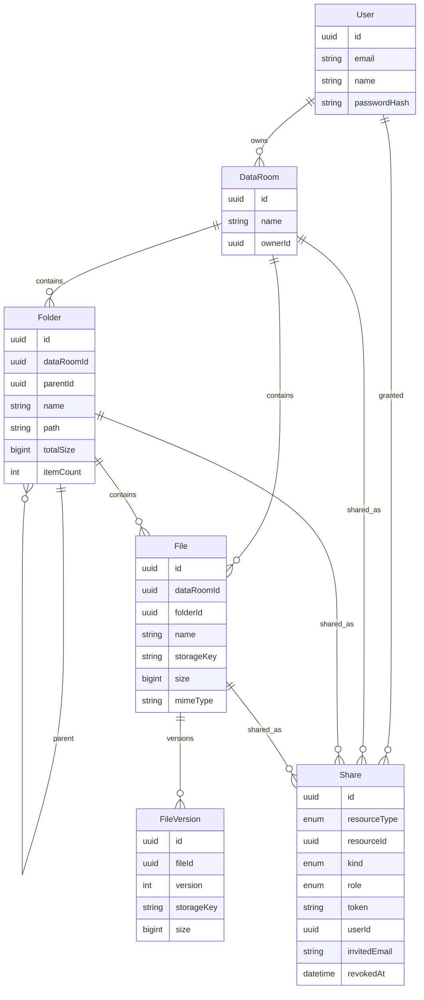

# GS1 Data Room

Virtual data room MVP: nested folders, PDF files, public links, and per-user sharing.

## Live URLs

- Frontend: _pending deploy — see Phase 7 notes in this README_
- Backend: _pending deploy — see Phase 7 notes in this README_

## Prerequisites

- [nvm](https://github.com/nvm-sh/nvm) or [nvm-windows](https://github.com/coreybutler/nvm-windows)
- Node **26.7.0** (`nvm use` reads `.nvmrc`)
- Docker (for local PostgreSQL) **or** a hosted Postgres URL (Neon)
- Optional: S3-compatible bucket (Cloudflare R2). Local disk is the default fallback.

```bash
nvm use 26.7.0
node -v   # v26.7.0
```

## Local setup

```bash
git clone https://github.com/user4i/DataRoom.git
cd DataRoom
nvm use
npm install

# Postgres
docker compose up -d

# API env
cp .env.example apps/api/.env
# Web env
cp .env.example apps/web/.env.local
# Edit both files: keep DATABASE_URL, JWT_SECRET, NEXT_PUBLIC_API_URL

npx prisma migrate deploy --schema apps/api/prisma/schema.prisma
npx prisma generate --schema apps/api/prisma/schema.prisma

npm run dev:api
# other terminal
npm run dev:web
```

Open http://localhost:3000 — API health: http://localhost:3001/health

## Environment variables

| Variable | Where | Required | Description |
|---|---|---|---|
| `DATABASE_URL` | API | yes | PostgreSQL connection string |
| `JWT_SECRET` | API | yes | Secret for access and storage tokens |
| `JWT_EXPIRES_IN` | API | no | Access token TTL (default `7d`) |
| `PORT` | API | no | API port (default `3001`) |
| `FRONTEND_URL` | API | yes | CORS origin, e.g. `http://localhost:3000` |
| `API_PUBLIC_URL` | API | yes | Public API base used in local upload/download URLs |
| `STORAGE_DRIVER` | API | no | `local` (default) or `s3` |
| `UPLOAD_DIR` | API | no | Local blob directory (default `./uploads`) |
| `S3_ENDPOINT` | API | if s3 | R2/S3 endpoint |
| `S3_REGION` | API | if s3 | Region (`auto` for R2) |
| `S3_BUCKET` | API | if s3 | Bucket name |
| `S3_ACCESS_KEY_ID` | API | if s3 | Access key |
| `S3_SECRET_ACCESS_KEY` | API | if s3 | Secret key |
| `S3_FORCE_PATH_STYLE` | API | no | Default `true` |
| `NEXT_PUBLIC_API_URL` | Web | yes | Browser-facing API URL |

Never commit `.env` or `.env.local`.

## Scripts

| Script | What it does |
|---|---|
| `npm run dev:api` | NestJS watch mode on port 3001 |
| `npm run dev:web` | Next.js dev server on port 3000 |
| `npm run build:api` | Generate Prisma client and compile NestJS |
| `npm run build:web` | Production Next.js build |
| `npm run db:generate` | `prisma generate` |
| `npm run db:migrate` | `prisma migrate dev` |
| `npm run db:deploy` | `prisma migrate deploy` |

## Repository structure

```
apps/api          NestJS + Prisma + storage (local disk or S3/R2)
apps/web          Next.js App Router + Tailwind + Shadcn
packages/shared   Shared DTO types
prisma schema     apps/api/prisma/schema.prisma
```

## ERD

Generated from the Prisma schema:



## Deploy

### Database (Neon)

1. Create a Neon project and copy `DATABASE_URL`.
2. From this repo: `DATABASE_URL=... npm run db:deploy`.

### Blob storage

- Dev: `STORAGE_DRIVER=local`.
- Prod: Cloudflare R2 (S3-compatible). Enable CORS on the bucket so the browser can `PUT` presigned URLs from the frontend origin. Allowed methods: `PUT`, `GET`, `HEAD`.

### API (Render)

`render.yaml` is in the repo root. Create a Web Service from this GitHub repo, or use the blueprint.

Required API env vars: `DATABASE_URL`, `JWT_SECRET`, `FRONTEND_URL`, `API_PUBLIC_URL`, plus S3 vars if `STORAGE_DRIVER=s3`.

Start command: `npm run start:prod -w api`  
Build command: `npm install && npm run db:generate && npm run db:deploy && npm run build:api`

Node version: `26.7.0` (see `.nvmrc` / `engines`).

### Web (Vercel)

Import the GitHub repo. Set **Root Directory** to `apps/web`.

Env: `NEXT_PUBLIC_API_URL=https://<your-api-host>`

Install command: from repo root `npm install` (workspaces). If Vercel uses `apps/web` as root, set Install to `cd ../.. && npm install` or keep the monorepo root as the Vercel project root with:

- Framework: Next.js
- Root directory: `apps/web`

### What you must do (no cloud tokens in this environment)

This workspace does not have Neon / Render / Vercel / R2 account tokens. After you create those services, paste the public URLs into the **Live URLs** section above.

Smoke checklist (incognito): register → create room → nested folder → upload PDF → rename/move → public link in a private window → share to a second account → revoke → delete folder with warning.

## Design decisions

## How it scales

### How do you compute size / count of a subtree?

### How would this work with 100k files in a room?

### How would you add viewer vs editor roles later?

## Where and how AI was used
