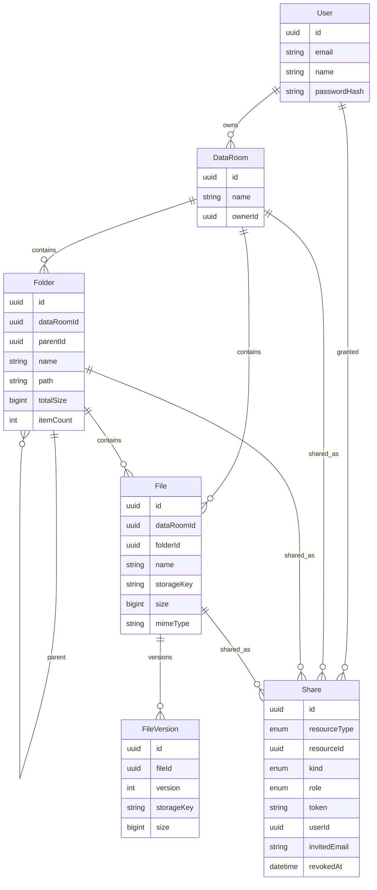

# GS1 Data Room

Virtual data room MVP: nested folders, PDF files, public links, and per-user sharing.

## Live URLs

- Frontend: [https://web-rosy-five-47.vercel.app](https://web-rosy-five-47.vercel.app)
- Backend: [https://dataroom-vkxm.onrender.com](https://dataroom-vkxm.onrender.com)

## Prerequisites

- [nvm](https://github.com/nvm-sh/nvm) or [nvm-windows](https://github.com/coreybutler/nvm-windows)
- Node **26.7.0** locally (`nvm use` reads `.nvmrc`); Vercel uses Node **24.x** (`engines` in `package.json`)
- Docker (for local PostgreSQL) **or** a hosted Postgres URL (Neon)
- Optional: S3-compatible bucket (Cloudflare R2). Local disk is the default fallback.

```bash
node -v          # skip nvm if this is already v26.7.0
nvm use          # only when the version does not match .nvmrc
```

Windows: `npm run dev:up` starts Postgres and applies migrations. It calls `nvm use` only if `node -v` is not **26.7.0**, and prefers Docker Desktop over leftover Toolbox `DOCKER_HOST`.

## Local setup

```bash
git clone https://github.com/user4i/DataRoom.git
cd DataRoom
node -v          # nvm use only if this is not v26.7.0
npm install

# Postgres + migrations (or: npm run dev:up)
docker compose up -d

# API env
cp .env.example apps/api/.env
# Web env
cp .env.example apps/web/.env.local
# Edit both files: keep DATABASE_URL, JWT_SECRET, NEXT_PUBLIC_API_URL

npx prisma migrate deploy --schema apps/api/prisma/schema.prisma
npx prisma generate --schema apps/api/prisma/schema.prisma

npm run dev:api
# other terminal
npm run dev:web
```

Open [http://localhost:3000](http://localhost:3000) — API health: [http://localhost:3001/health](http://localhost:3001/health)

## Environment variables


| Variable               | Where | Required | Description                                        |
| ---------------------- | ----- | -------- | -------------------------------------------------- |
| `DATABASE_URL`         | API   | yes      | PostgreSQL connection string                       |
| `JWT_SECRET`           | API   | yes      | Secret for access and storage tokens               |
| `JWT_EXPIRES_IN`       | API   | no       | Access token TTL (default `7d`)                    |
| `PORT`                 | API   | no       | API port (default `3001`)                          |
| `FRONTEND_URL`         | API   | yes      | CORS origin, e.g. `http://localhost:3000`          |
| `API_PUBLIC_URL`       | API   | yes      | Public API base used in local upload/download URLs |
| `STORAGE_DRIVER`       | API   | no       | `local` (default) or `s3`                          |
| `UPLOAD_DIR`           | API   | no       | Local blob directory (default `./uploads`)         |
| `S3_ENDPOINT`          | API   | if s3    | R2/S3 endpoint                                     |
| `S3_REGION`            | API   | if s3    | Region (`auto` for R2)                             |
| `S3_BUCKET`            | API   | if s3    | Bucket name                                        |
| `S3_ACCESS_KEY_ID`     | API   | if s3    | Access key                                         |
| `S3_SECRET_ACCESS_KEY` | API   | if s3    | Secret key                                         |
| `S3_FORCE_PATH_STYLE`  | API   | no       | Default `true`                                     |
| `NEXT_PUBLIC_API_URL`  | Web   | yes      | Browser-facing API URL                             |


Never commit `.env` or `.env.local`.

## Scripts


| Script                | What it does                              |
| --------------------- | ----------------------------------------- |
| `npm run dev:up`      | Postgres + migrations; `nvm use` only if Node ≠ `.nvmrc` |
| `npm run dev:api`     | NestJS watch mode on port 3001            |
| `npm run dev:web`     | Next.js dev server on port 3000           |
| `npm run build:api`   | Generate Prisma client and compile NestJS |
| `npm run build:web`   | Production Next.js build                  |
| `npm run db:generate` | `prisma generate`                         |
| `npm run db:migrate`  | `prisma migrate dev`                      |
| `npm run db:deploy`   | `prisma migrate deploy`                   |


## Repository structure

```
apps/api          NestJS + Prisma + storage (local disk or S3/R2)
apps/web          Next.js App Router + Tailwind + Shadcn
packages/shared   Shared DTO types
prisma schema     apps/api/prisma/schema.prisma
```

## ERD

Generated from the Prisma schema:




## Deploy

### Database (Neon)

1. Create a Neon project and copy `DATABASE_URL`.
2. From this repo: `DATABASE_URL=... npm run db:deploy`.

### Blob storage

- Dev: `STORAGE_DRIVER=local`.
- Prod: Cloudflare R2 (S3-compatible). Enable CORS on the bucket so the browser can `PUT` presigned URLs from the frontend origin. Allowed methods: `PUT`, `GET`, `HEAD`.

### API (Render)

`render.yaml` is in the repo root. Create a Web Service from this GitHub repo, or use the blueprint.

Required API env vars: `DATABASE_URL`, `JWT_SECRET`, `FRONTEND_URL`, `API_PUBLIC_URL`, plus S3 vars if `STORAGE_DRIVER=s3`.

Start command: `npm run start:prod -w api`  
Build command: `npm install && npm run db:generate && npm run db:deploy && npm run build:api`

Node version: `26.7.0` (see `.nvmrc` / `engines`).

### Web (Vercel)

Production deploys are triggered by GitHub Actions on push to `main` (Vercel CLI + token). Do **not** connect the Vercel GitHub App.

Create an **empty** Vercel project (no Git integration). The workflow deploys from the **monorepo root** (`npx vercel deploy --prod --yes`, no `--cwd`) so workspace install can see the lockfile. Set the Vercel project Root Directory to `apps/web`. Do **not** also pass `--cwd apps/web` — Root Directory and `--cwd` must not both be `apps/web`.

`NEXT_PUBLIC_API_URL` is passed at deploy time from a GitHub Actions secret (inlined into the Next.js client bundle). Hobby usually has Settings → Environment Variables for Production; if the UI requires Pro, skip the dashboard and use the GitHub secret instead.

See **CI/CD** below for the GitHub secrets.

### What you must do (no cloud tokens in this environment)

Public URLs are listed at the top of this README. Keep Actions secrets and service env vars in sync if those hosts change.

Smoke checklist (incognito): register → create room → nested folder → upload PDF → rename/move → public link in a private window → share to a second account → revoke → delete folder with warning.

## CI/CD (GitHub Actions)

Push and pull requests run **CI** (`.github/workflows/ci.yml`): `npm ci`, then build `apps/api` and `apps/web`. Node **24** (Vercel-compatible).

Push to `main` runs **CD** (`.github/workflows/deploy.yml`):

1. Optional Prisma migrate against Neon when `DATABASE_URL` is set (skipped if the secret is missing).
2. Web → Vercel from the repo root (`npx vercel deploy --prod --yes`, using `VERCEL_ORG_ID` / `VERCEL_PROJECT_ID`; Root Directory `apps/web`, no `--cwd`).
3. API → Render via a Deploy Hook. `render.yaml` in the repo root is the service blueprint (create the web service once in the Render dashboard).

The first production deploy runs only after the secrets below exist, an empty Vercel project is created (so `VERCEL_ORG_ID` / `VERCEL_PROJECT_ID` are known), and the Render service exists with a Deploy Hook.

**GitHub → Settings → Secrets and variables → Actions**


| Secret                | Required  | Where to get it                                                                                 |
| --------------------- | --------- | ----------------------------------------------------------------------------------------------- |
| `VERCEL_TOKEN`        | yes (web) | [Vercel account tokens](https://vercel.com/account/tokens) — same account that owns the project |
| `VERCEL_ORG_ID`       | yes (web) | Team ID of the project's team (Hobby: **Your ID** on the account/tokens page)                   |
| `VERCEL_PROJECT_ID`   | yes (web) | Vercel project → Settings → General                                                             |
| `NEXT_PUBLIC_API_URL` | yes (web) | Public Render URL of the API, **without** `/health` (e.g. `https://<service>.onrender.com`)     |
| `RENDER_DEPLOY_HOOK`  | yes (API) | Render service → Settings → Deploy Hook                                                         |
| `DATABASE_URL`        | optional  | Neon connection string; the migrate job no-ops when this is unset                               |


## Design decisions

## How it scales

### How do you compute size / count of a subtree?

### How would this work with 100k files in a room?

### How would you add viewer vs editor roles later?

## Where and how AI was used

1. Base project setup - 

**AI usage -- step-by-step plan by task**
*My part -- General quick analizing, creating Gighub Project, informig AI that node versions are organized with nvm (Node Version Manager)*

2. Base project setup - developed

**AI usage -- fully, commits**
*My part -- analyzing the process*

3. Local and remote deploy - preparation

**AI usage -- insturctions and partial automation**
*My part -- Some technical moments. I changed plan with direct uploading files to Vercel/Render/Neon by Github CI/CD (Actions).*

5. Testing, some small corrections, project clearing, README changes - 

**AI usage -- just analything, commits**
*My part -- most.*

6. Double checking base version by task details. (in process)

**AI usage -- partially.**
*My part -- partially.*

7. UX Optimizing. (in process)

**AI usage -- partially.**
*My part -- partially.*

8. Thinking part personal double check and Deliverables, optimization (in process)

**AI usage -- partially.**
*My part -- partially.*

9. Extra credit (in process)

**AI usage -- partially.**
*My part -- partially.*

10. Most commits by AI

**AI usage -- commit message, commit.**
*My part -- check code, especially from starting base version optimization.*

## Time spending

~1 hour = Plan + Base Development
~1 hour = Deploy
~1 hour = Testing, code clearing, my part of README